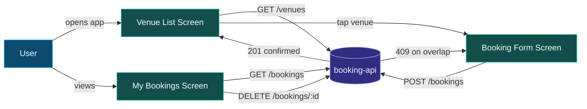

<p align="center">
  
  
  
  
</p>

A Flutter front-end for the [booking-api](https://github.com/layankhayyat04-ui/booking-api) — the mobile client that turns three REST endpoints into a real, usable booking flow: **browse venues, book a court, and manage your own bookings.**

---

### ✨ Features

- 📋 **Live venue list** — pulled straight from `GET /venues`, no mock data
- 🗓️ **Guided booking form** — date/time pickers, court selection, duration — validated before it ever hits the network
- ⚠️ **Server-driven error messages** — a `409` overlap conflict from the API is shown to the user verbatim, not swallowed by a generic "something went wrong"
- ❌ **Cancel from the app** — soft-cancels a booking via `DELETE /bookings/:id` and refreshes the list instantly

### 📱 Tech Stack

<p align="center">
  
  
  
  
</p>

| | |
|---|---|
| **Framework** | Flutter (Material 3) |
| **Language** | Dart |
| **Networking** | `http` package, typed `ApiException` on non-2xx |
| **Backend** | [booking-api](https://github.com/layankhayyat04-ui/booking-api) — Node.js + Express + PostgreSQL |

### 🏗 Architecture



### 📂 Screens

| Screen | What it does |
|---|---|
| **Venues** | Lists all venues via `GET /venues`. Tap one to start booking. |
| **Book a court** | Pick a court, date, start time, duration → `POST /bookings`. Shows the server's own conflict message on `409`. |
| **My Bookings** | Lists bookings via `GET /bookings`; cancel via `DELETE /bookings/:id`. |

### 🚀 Quick start

```bash
git clone https://github.com/layankhayyat04-ui/booking-app-flutter.git
cd booking-app-flutter
flutter pub get
```

Point `baseUrl` in `lib/services/pi_service.dart` at your running [booking-api](https://github.com/layankhayyat04-ui/booking-api) instance, then:

```bash
flutter run
```

### 📁 Repository map

```text
booking-app-flutter/
├── lib/
│   ├── main.dart              # App entry point, theming
│   ├── models/                # Venue, Booking (fromJson)
│   ├── screens/                # Venue list, booking form, my bookings
│   └── services/
│       └── pi_service.dart    # ApiService — all REST calls, typed errors
├── android/ ios/ web/          # Platform scaffolding
└── pubspec.yaml
```

### 📝 Design notes

- **Server errors surface verbatim.** A `409` overlap conflict from the API is parsed and shown directly in the booking form — no generic "error occurred" message.
- **State is explicit.** Each screen manages its own `Future` and reloads via `setState`, keeping data flow easy to trace without extra state-management libraries.
- **Typed models.** `Venue` and `Booking` both use `fromJson` factories, so a shape mismatch from the API fails fast and visibly instead of silently.

---

<p align="center">

**Built by [Layan Khayyat](https://github.com/layankhayyat04-ui)**

Explore more: [Booking API](https://github.com/layankhayyat04-ui/booking-api) · [BMS Dashboard](https://github.com/layankhayyat04-ui/bms-dashboard) · [CV RAG Chatbot](https://github.com/layankhayyat04-ui/cv-rag-chatbot)

  

</p>
